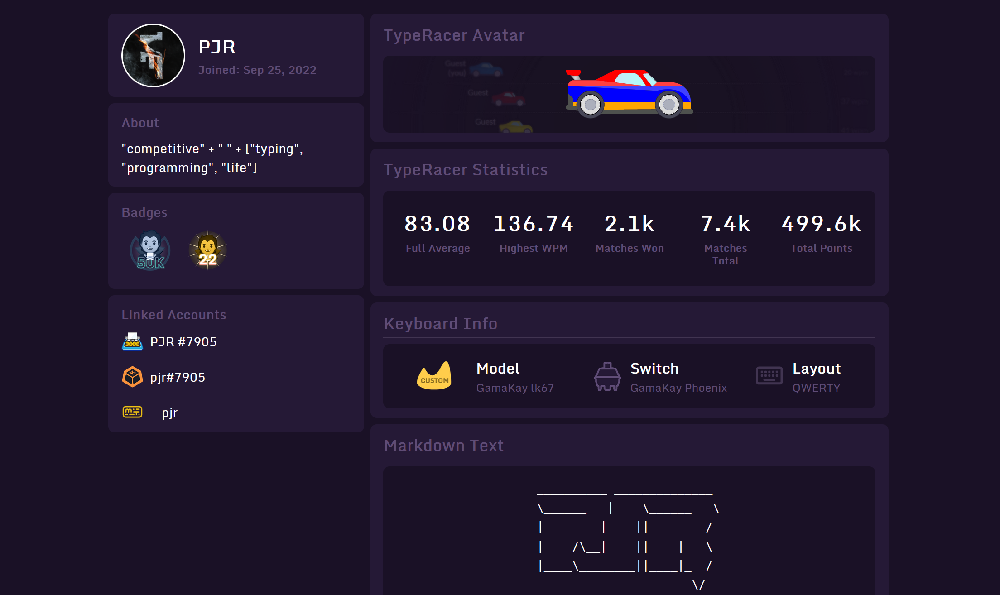

---
hide:
  - navigation
  - toc
  - footer
---

# Typingstats-ը և ինչպես ստանալ Հայաստանի մեքենան Typeracer-ում
`Ամսաթիվը` _`12.01.2023`_

[Typingstats.com](https://typingstats.com/)-ը սեպտեմբերի 22-ին եկավ լրացնելու սպորտային մեքենագրման(competitive typing) ոլորտում մեծ բացը։ Առաջարկվեց հնարավորություն մեկ տեղում հավաքելու ձեր մասին տեղեկատվությունը, բազմաթիվ կայքերի հաշիվները(account), ձեր օգտագործելիք ստեղնաշարի տեղեկատվությունը և այլն։ Իրոք, շատ ավելի հարմար եմ գտնում հետաքրքրվողներին մեկ լինքով ներկայացնել բոլոր հաշիվներս։

Նաև Typingstats-ում անցկացվում են բազմաթիվ միջոցառումներ, որոնց մասնակցելով հնարովորթյուն եք ստանում շահել նվերներ(օրինակ ինձ պես մեկ տարվա Typeracer Premium): Դրանց մասին առաջինը կարող եք տեղեկանալ իրենց Discord-ում:

Իմ Typingstats-ի հաշիվը կարող եք գտնել կայքի վերջնագրում(footer):

---

Իսկ հիմա թե ինչպես ստանալ Հայաստանի դրոշով մեքենան Typeracer-ում։ Ուղղակի պետք է գրել նամակ կայքի խմբագիրներին։ Ես անձամբ գրել եմ իրենց տրամադրած կապի [լինքով](https://teachmehelp.zendesk.com/hc/en-us/requests/new)։ Մոտ մեկ-երկու օրվա ընթացքում նրանք ավելացնում են այդ մեքենան ձեր հաշվում։ Բացասական կողմը այն է, որ այլ մեքենա ընտրելուց նորից կորցնում եք այս մեքենան։ Կարծում եմ, որ Typeracer-ում տանում են աշխատանքներ բոլոր երկրների դրոշները ավելացնելու համար, բայց հայերի կողմից ցույց տված հետաքրքրությունը կարող է միայն նպաստել այդ արագացնելուն։
